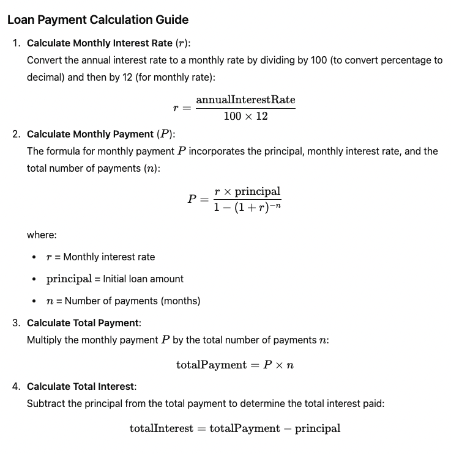
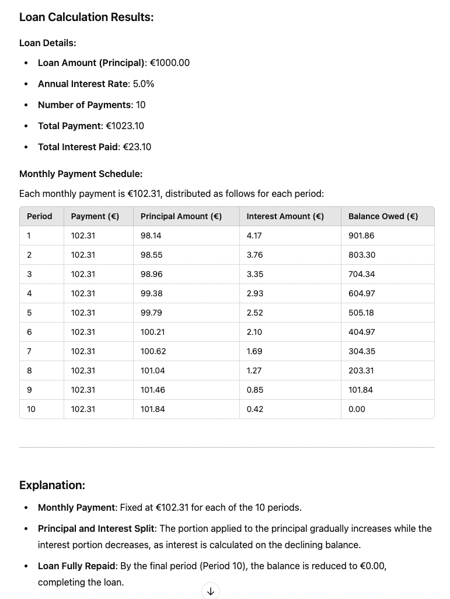

# Loan Calculation Service


## Overview

The **Loan Calculation Service** is a Spring Boot-based RESTful API designed to calculate loan details, including the payment schedule, based on the provided loan amount, interest rate, and number of payments.
Along with request data, database stores calculated total payment and total interest for given loan, as well as date of loan creation.

Implementation logic is based on https://www.calculatorsoup.com/calculators/financial/amortization-schedule-calculator.php .


## Amortization Calculator formula:



## Result:




## Technologies Used

- **Java 21**
- **Spring Boot 3.3.5**
- **Maven**
- **PostgreSQL 15 (running inside Docker container)**
- **JUnit 5**
- **Mockito**
- **TestContainers (for integration testing)**
- **Flyway**
- **Springdoc OpenAPI (Swagger)**
- **Lombok**

## Getting Started

1. **Clone the repo, build project, run docker-compose for pgres, start the application, make a request(jq for pretty-printing or without it)**

   ```bash
   git clone https://github.com/kukilej/loan-calculation-service.git
   cd loan-calculation-service
   mvn clean install
   docker-compose up -d
   mvn spring-boot:run
   curl -X POST http://localhost:8080/api/v1/loans/calculate \
     -H "Content-Type: application/json" \
     -d '{
           "loanAmount": 1000.00,
           "interestRate": 5.0,
           "numberOfPayments": 3
         }' | jq


   

## Endpoint: POST /api/v1/loans/calculate

Description: Calculates loan details, including total payment, total interest, and generates a payment schedule based on the provided loan amount, interest rate, and number of payments.

### Request Body:

- **All 3 fields are mandatory**
- **Loan amount must be greater than 0**
- **Interest rate must be at least 0**
- **Number of payments must be at least 1**


```json
{
    "loanAmount": 1000.00,
    "interestRate": 5.0,
    "numberOfPayments": 3
}
```

### 200 Response:

```json
{
"loanId": 17,
"loanAmount": 1000.00,
"interestRate": 5.0,
"numberOfPayments": 3,
"totalPayment": 1008.33,
"totalInterest": 8.33,
"paymentSchedule": [
    {
    "period": 1,
    "payment": 336.11,
    "principalAmount": 331.94,
    "interestAmount": 4.17,
    "balanceOwed": 668.06
    },
    {
    "period": 2,
    "payment": 336.11,
    "principalAmount": 333.33,
    "interestAmount": 2.78,
    "balanceOwed": 334.73
    },
    {
    "period": 3,
    "payment": 336.11,
    "principalAmount": 334.73,
    "interestAmount": 1.39,
    "balanceOwed": 0.00
    }
]
}
```

### 400 Response (for interestRate = a5.0):

```json
{
"timestamp": "2024-11-05T11:20:59.242376",
"status": 400,
"error": "Malformed JSON Request",
"message": "JSON parse error: Unrecognized token 'a5': was expecting (JSON String, Number, Array, Object or token 'null', 'true' or 'false')",
"path": "/api/v1/loans/calculate",
"details": null
}
```
### 400 Response (for no. of payments = 0):

```json
{
	"timestamp": "2024-11-05T11:22:51.908733",
	"status": 400,
	"error": "Validation Failed",
	"message": "Invalid input parameters",
	"path": "/api/v1/loans/calculate",
	"details": [
		"Field 'numberOfPayments' Number of payments must be at least 1"
	]
}
```

### 500 Response (for unavailable db, timeout set to 5sec for example purposes):

```json
{
"timestamp": "2024-11-05T11:29:43.913669",
"status": 500,
"error": "Internal Server Error",
"message": "Could not open JPA EntityManager for transaction",
"path": "/api/v1/loans/calculate",
"details": null
}
```
### Remarks:

- **Getting identical values for total payment with online tool was difficult so tests assertions have small tolerance for error (up to 0.1 $)**

- **Online tool also allows negative values for LoanAmount which I didn't want to allow.**

